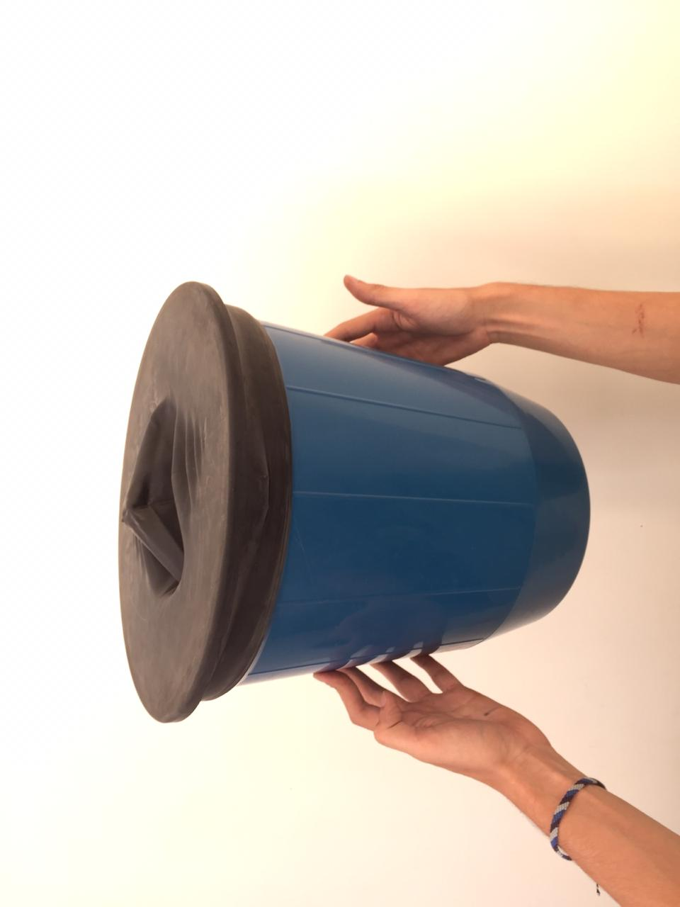

# 2019.2-Vorticidade (Vórtice Toroidal)

# Seção 1: Início

## Integrantes
Álef Vinícius R. Dias (alefvrdias) - 16/0109311  
Bruno de Castro Silva (brunodecastrosilva) - 17/0138534  
Felipe Moreno Lago dos Anjos (felipemoreno9) - 17/0033392  

## Experimento

O objetivo deste experimento é determinar os parâmetros que influenciam a estabilidade de um vórtice toroidal. Para isso, será testada experimentalmente a estabilidade de vórtices quando a linha de vórtice forma um anel (um vórtice com topologia toroidal) e será comparada com o tempo de duração ao se mudar as dimensões do vórtice.

## Requisitos de Solução

Para que o objetivo do experimento seja realizado, primeiramente é necessária a construção de um equipamento que produza os vórtices. Dessa forma, e por determinação do grupo, tal equipamento usará fumaça como fonte para a produção dos vórtices, sendo eles produzidos e analisados no ar. Os mesmos poderiam ser produzidos na água, mas, por conveniência do grupo, a utilização do ar como meio de propagação dos vórtices torna o experimento mais simples.

Em relação ao equipamento que será construído, sua principal função será produzir os vórtices com o diâmetro bem definido. Serão analisados vórtices de 10 diâmetros distintos. Assim, a saída do equipamento por onde os vórtices passarão terá uma atenção especial, pois deverá ser variável de acordo com o diâmetro desejado. No entanto, o equipamento não é complexo. Sua estrututa será composta, basicamente, por uma entrada de fumaça, uma câmara para o armazenamento da fumaça e uma saída para os vórtices. A produção dos vórtices será devida a uma força externa que agirá no equipamento, impulsionando a fumaça à saída e nela formando os anéis de fumaça naturalmente.

Para a coleta de dados do experimento, serão medidos, a partir da formação (saída do equipamento) até a dissipação, o tempo de duração e a distância retilínea percorrida de cada anel de fumaça com um cronômetro e uma trena, respectivamente. E, com o diâmetro previamente estabelecido, essas três informações serão a base para a análise da estabilidade dos vórtices.

Por fim, para minimizar os efeitos de irregularidades no ambiente e diferenças na formação dos vórtices de mesmo diâmetro, serão feitos múltiplos testes e uma análise estatística dos dados. Após a coleta de dados, será determinada a relação entre as grandezas medidas.

## Escopo do Experimento
### Etapa 1: Produção dos Vórtices

O objetivo da primeira etapa consiste em produzir o dispositivo necessário para a produção dos vórtices, no caso, um dispositivo para se produzir anéis de fumaça, e estabelecer um local apropriado para que o estudo dos mesmos seja realizado com eficácia.

### Etapa 2: Avaliação dos Vórtices

O objetivo da segunda etapa consiste em estabelecer e utilizar os instrumentos de medição necessários (trena e cronômetro) para a coleta dos dados experimentais para determinação da relação entre as dimensões do vórtice, seu tempo de duração, o espaço percorrido e sua velocidade.

## Avaliação de Viabilidade

Não estão previstas dificuldades em relação ao custo e à montagem do experimento, pois a maior parte dos recursos necessários já está a disposição. O grande desafio esperado está presente na análise precisa dos vórtices produzidos. Sendo assim, serão necessários vários testes sob as mesmas condições, demandando muito tempo e um ambiente que não interfira no comportamento dos vórtices. Conclui-se, então, que o projeto é viável, dado que o desafio de precisão pode ser resolvido utilizando-se de ferramentas estatísticas.

# Seção 2: Planejamento e Preparação

## Procedimentos Experimentais e Preparação

Se uma linha de vórtex é uma curva tangente em todos os pontos ao vetor do vórtex ω = ∇ × **u** e uma folha de vórtex é uma superfície tangente ao mesmo vetor em todos os pontos, a superfície (ou curva) de vórtex se movendo em um escoamento em um fluído isentrópico, continua como como uma superfície (ou curva) de vórtex de acordo com o teorema de Helmholtz se um tubo de vórtex é uma coleção de linhas de vórtex, tal que elas podem se estender umas sobre as outras, então a força do tubo de vórtex é constante. Em outras palavras, vórtices são estáveis. Uma configuração ainda mais estável é quando o eixo central dos tubos de vórtex forma um anel. É nessa configuração que está focado o estudo da estabilidade neste trabalho.

Para a execução dos testes quanto à estabilidade do vórtex toroidal, todos os membros se reunirão na FGA no horário de laboratório para a execução das atividades de acordo com o cronograma mostrado. O procedimento utilizado, uma vez que o dispositivo de criação dos anéis de fumaça estiver operacional, consiste em produzir, para cada diâmetro especificado, cinco anéis de fumaça, cronometrando sua duração e medindo seu deslocamento, registrando as medidas em uma tabela, além de documentando o processo com fotos.

### Cronograma

É estimado que a etapa de experimentos e coleta de dados leve cerca de quatro semanas.

Data  | Atividade
----  | ---------
18/09 | Confecção do dispositivo de anéis de fumaça e definição dos diâmetros dos furos testados
02/10 | Teste com os diâmetros 1, 2 e 3
09/10 | Teste com os diâmetros 4, 5 e 6
16/10 | Teste com os diâmetros 7, 8, 9 e 10

Na primeira semana de atividades, no dia 18 de setembro, será construído o dispositivo para analisar os vórtices, assim como os diâmetros a serem utilizados no experimento. O aparato será constituído de um cilindro com um dos lados fechados com uma membrana impermeável e o outro lado aberto com um encaixe para alterar o diâmetro de saída. Na mesma semana serão confeccionadas dez saídas com diferentes tamanhos que serão usadas nas semanas seguintes para as medições.

Em outubro, nas três primeiras semanas serão feitas as medições, sendo na semana 1 e 2 os testes com 3 diâmetros cada e na terceira semana com 4 diâmetros. Os testes serão feitos todos da mesma forma.

Utilizando uma máquina de fumaça, o dispositivo será preenchido e, após encaixar a saída com o diâmetro específico, usaremos a membrana para expulsar a fumaça, criando o vórtex e assim medindo as suas dimensões, tempo de duração, espaço percorrido e velocidade. Para cada uma das dez saídas o experimento será repetido cinco vezes e colocados os dados obtidos em uma tabela.

## Resultados Esperados 

É esperado que a velocidade do vórtice seja inversamente proporcional ao seu diâmetro. Como o teorema garante a permanência dos vórtices apenas em fluidos ideais, quanto mais as características do ar o afastarem das de um fluido ideal, menos estáveis espera-se que os vórtices sejam, logo, a estabilidade deve diminuir com o aumento da velocidade. Sendo assim, o tempo de duração do vórtice deve ser proporcional ao diâmetro. Por outro lado, o espaço percorrido por cada vórtice pode não apresentar tanta variação, já que os vórtices mais velozes devem se dissipar em menos tempo e os mais lentos demorarem mais para se dissipar.

## Imagem teste

