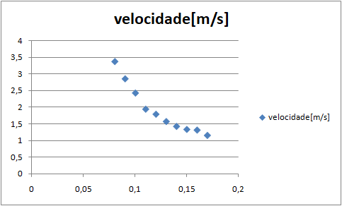
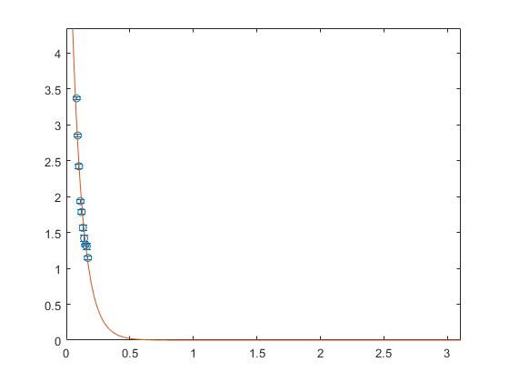
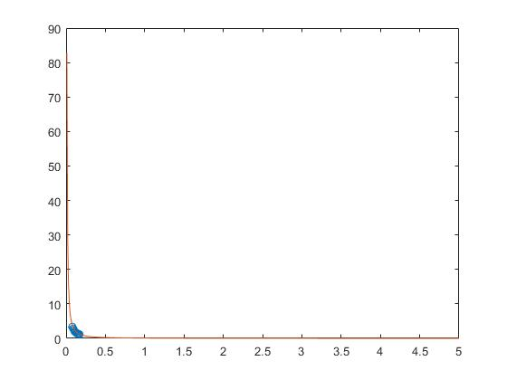
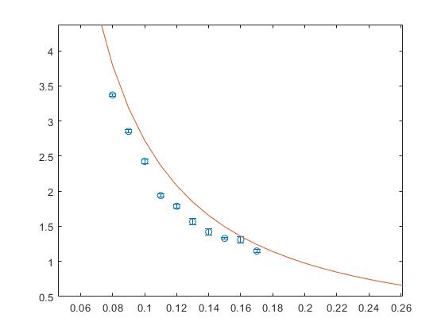
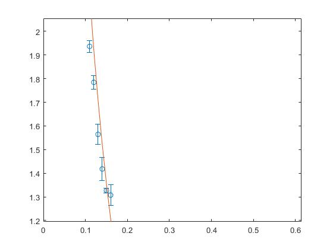

# 2019.2-Vorticidade (Vórtice Toroidal)

# Seção 1: Início

## Integrantes
Álef Vinícius R. Dias (alefvrdias) - 16/0109311  
Bruno de Castro Silva (brunodecastrosilva) - 17/0138534  
Felipe Moreno Lago dos Anjos (felipemoreno9) - 17/0033392  

## Experimento

O objetivo deste experimento é determinar como o diâmetro de um vórtice toroidal interfere em sua velocidade. Para isso, será medida experimentalmente a velocidade de vórtices quando a linha de vórtice forma um anel (um vórtice com topologia toroidal) e ela será comparada com o diâmetro do vórtice.

Se uma linha de vórtex é uma curva tangente em todos os pontos ao vetor do vórtex ω = ∇ × **u** e uma folha de vórtex é uma superfície tangente ao mesmo vetor em todos os pontos, a superfície (ou curva) de vórtex se movendo em um escoamento em um fluído isentrópico continua como uma superfície (ou curva) de vórtex. De acordo com o teorema de Helmholtz se um tubo de vórtex é uma coleção de linhas de vórtex, tal que elas podem se estender umas sobre as outras, então a força do tubo de vórtex é constante. Em outras palavras, vórtices são estáveis. Uma configuração ainda mais estável é quando o eixo central dos tubos de vórtex forma um anel.

Uma característica interessante dessa configuração é que, seguindo-se a linha de vórtice, os vetores de vortex diametralmente opostos rotacioam em sentidos diferentes, esse efeito causa um movimento retilíneo, como mostrado no Gif 1:

 Gif 1

## Requisitos de Solução

Desenvolver um sistema que possibilite mensurar a velocidade do vórtex em relação ao diâmetro. Para isso, é necessário:
<ul><li> Um dispositivo para criar o vórtex;</li>
<li>Observar o vórtex nos seguintes pontos: diâmetro, tempo de duração e distância percorrida usando aparatos de medição;</li> 
<li>Relacionar os resultados em tabelas e gráficos para determinar a relação entre a velocidade e o diâmetro.</li></ul>

## Escopo do Experimento

Para que seja determinada a relação entre a velocidade do vórtice e o seu diâmetro, primeiramente é necessária a construção de um equipamento que produza os vórtices. Dessa forma, e por determinação do grupo, tal equipamento usará fumaça como fonte para a produção dos vórtices, sendo eles produzidos e analisados no ar. Os mesmos poderiam ser produzidos na água, mas, por conveniência do grupo, a utilização do ar como meio de propagação dos vórtices torna o experimento mais simples.

Em relação ao equipamento que será construído, sua principal função será produzir os vórtices com o diâmetro bem definido. Serão analisados vórtices de 10 diâmetros distintos. Assim, a saída do equipamento, por onde os vórtices passarão, terá uma atenção especial porque deverá ser variável de acordo com o diâmetro desejado. No entanto, o equipamento não é complexo. Sua estrutura será composta, basicamente, por uma entrada de fumaça, uma câmara para o seu armazenamento e uma saída para os vórtices. A produção dos vórtices será devida a uma força externa que agirá no equipamento, impulsionando a fumaça à saída e nela formando os anéis de fumaça naturalmente.

Para a coleta de dados do experimento, serão medidos, a partir da formação (saída do equipamento) até uma parede a uma distância fixa, o tempo de viagem de cada anel de fumaça com um cronômetro. Esses dados (valores de tempo, distância percorrida e diâmetro da abertura) serão organizados em uma planilha para análise posterior.

Por fim, para minimizar os efeitos de irregularidades no ambiente e diferenças na formação dos vórtices de mesmo diâmetro, serão feitos múltiplos testes e uma análise estatística dos dados. Após a coleta de dados, será determinada a relação entre as grandezas medidas.

# Seção 2: Planejamento e Preparação

## Procedimentos Experimentais e Preparação

Para a execução dos testes quanto à velocidade do vórtex toroidal, todos os membros se reunirão na FGA no horário de laboratório para a execução das atividades de acordo com o cronograma mostrado. O procedimento utilizado, uma vez que o dispositivo de criação dos anéis de fumaça estiver operacional, consiste em produzir, para cada diâmetro especificado, cinco anéis de fumaça, cronometrando sua duração para o deslocamento especificado, registrando as medidas em uma tabela e documentando o processo com fotos.

Para realizar o experimento, serão feitos anéis de fumaça com o dispositivo feito e com o auxílio da máquina de fumaça. As grandezas de interesse serão medidas com um cronômetro e uma trena. Com o tempo e o espaço percorrido, será calculada a velocidade média.

### Cronograma

É estimado que a etapa de experimentos e coleta de dados leve cerca de quatro semanas.

Data  | Atividade
----  | ---------
18/09 | Confecção do dispositivo de anéis de fumaça e definição dos diâmetros dos furos testados 
19/10 | Confecção das placas 1 a 10 
23/10 | Teste com os diâmetros 1, 2, 3, 4 e 5
30/10 | Teste com os diâmetros 6, 7, 8, 9 e 10

Na primeira semana de atividades, no dia 18 de setembro, será construído o dispositivo para analisar os vórtices, assim como a definição dos diâmetros a serem utilizados no experimento. O aparato será constituído de um balde com um dos lados fechados com uma membrana impermeável e o outro lado aberto com um encaixe para alterar o diâmetro de saída.

Em outubro, serão confeccionadas dez saídas com diferentes tamanhos que serão usadas nas semanas seguintes para as medições, sendo no dia 23 os testes com 5 diâmetros e no dia 30 os 5 diâmetros restantes. Os testes serão feitos todos da mesma forma.

Utilizando uma máquina de fumaça, o dispositivo será preenchido e, após encaixar a saída com o diâmetro específico, usaremos a membrana para expulsar a fumaça, criando o vórtex e assim medindo as suas dimensões, tempo de duração e espaço percorrido para então fazer a relação entre diâmetro e velocidade. Para cada uma das dez saídas, o experimento será repetido cinco vezes e os dados obtidos serão organizados em uma planilha.

## Resultados Esperados 

Um fenômeno semelhante ao analisado nesse experimento pode ser observado na natureza em interações entre furacões, pois quando formados no mesmo hemisfério eles rotacionam no mesmo sentido, logo tem um efeito semelhante a um furacão orbitar o outro, como pode ser visto no Gif 2:

  
 Gif 2
  

Porém, quando furacões de hemisférios diferentes estão próximos eles se movem na direção em que o vetor de vórtice aponta entre os dois. Como pode ser visualizado no Gif 3:

 Gif 3
  

Uma secção do vórtice toroidal tem esse mesmo comportamento ao longo de todo o vórtice, como pode ser visualizado no Gif 4:

 Gif 4

Assim é esperado que o movimento seja descrito por um vetor de velocidade dependente dos mesmo parâmetros, sendo assim, perpendicular ao plano que contém a linha de vórtice, no sentido dos vetores de vórtice mais próximos do centro e com magnitude dependente da distância mínima entre os vetores de vórtice diametralmente opostos, ou seja, é esperado que a velocidade do vórtice seja inversamente proporcional ao seu diâmetro. Isso será aferido graficamente por meio das medições retiradas do experimento.

# Seção 3: Execução

## Procedimentos Experimentais

### Construção do Dispositivo 

O dispositivo criado para o experimento consiste em um balde com um furo de 170 milímetros de diâmetro no centro de sua base (parte de baixo). O furo foi desenhado com um compasso e cortado com um estilete. A parte de cima foi vedada com um balão de festa grande e o balão foi fixado no balde com uma camada reforçada de fita isolante. O resultado dessa etapa pode ser visto nas figuras 1 e 2.

Figura 1: Vista para o furo na base do balde.

Figura 2: Vista para o balão na parte de cima do balde.

Em seguida, foram feitos furos na base do balde para prender parafusos que servirão de encaixe para os discos responsáveis pela formação dos vórtices de diâmetros distintos. Nota-se que, na Figura 3, são 4 pares de furos igualmente espaçados, mas apenas metade deles foram aproveitados com os parafusos. Isso se deve ao fato de que a ideia inicial era utilizar arame para prender os discos, mas os testes realizados mostraram que eles não são práticos e estavam rasgando o papelão, então o arame foi substituído por parafuso. A utilização de apenas 4 parafusos é suficiente para prender bem os discos no balde. Os furos foram feitos esquentando a ponta de um pequeno pedaço de arame com isqueiro e rapidamente pressionando-o no balde. As posições dos furos foram previamente marcadas e foi utilizado um alicate para segurar o arame e evitar possíveis queimaduras. Depois disso, os parafusos foram fixos com chave de fenda.

Figura 3: Base do balde com parafusos fixados.

Em seguida, foram feitos os discos que servirão para produzir os vórtices com os diâmetros desejados, sendo tais discos feitos a partir de caixas de papelão não utilizadas. Eles foram desenhados com um compasso e cortados com tesoura e estilete. O diâmetro maior é comum a todos os discos e tem 200 milímetros, que coincide com o diâmetro da base do balde. Os diâmetros internos variam de 80 até 160 milímetros, totalizando 9 discos. Depois disso, foram feitos pequenos furos para serem fixados nos parafusos. O resultado dessa etapa pode ser visto nas figuras 4 e 5.

Figura 4: Discos maiores sobre discos menores.

Figura 5: Discos em ordem decrescente de diâmetro interno.

Por fim, visando um possível problema com a diferença de intensidade da força aplicada no balão em cada teste, ocasionando um grave erro experimental quanto à velocidade de saída do vórtice do dispositivo, foi feito um limitador para o balão, como mostram as figuras 6 e 7, para que em todos os testes o balão fosse esticado da mesma forma. O limitador foi feito com barbante e com uma pequena bola de gude. Foram feitos 4 furos equidistantes no balde da mesma forma que foram feitos os furos para os parafusos. Em cada furo foi passado um pedaço de barbante e um nó foi feito na ponta de cada um na parte de dentro do balde para não saírem do furo. Logo após, a bola de gude foi colocada no centro do balão e os quatro pedaços de barbante foram amarrados em volta da bola de gude. O tamanho dos pedaços de barbante foi o mínimo necessário para que o balão fosse esticado o suficiente para produzir todos os vórtices estáveis e que percorressem uma distância mínima de 5 metros.

Figura 6: Limitador para o balão.

Figura 7: Balão limitado.

### Realização dos testes

## Dados Medidos

O experimento foi sujeito a um grande erro experimental, devido a fatores tais como a força aplicada na membrana para expulsar a fumaça, os momentos corretos a serem cronometrados em que o vórtice seria formado até o momento que ele passaria pelo limite que definimos, além do ambiente não se manter constante devido ao ambiente se encher de fumaça à medida que o experimento se prolongasse, o que causou aparende diminuição da velocidade dos vórtices. Devido a essa metodologia não é possível calcular o erro experimental associado as medições feitas, por isso o parâmetro utilizado para visualização dos desvios é o desvio padrão nos tempos medidos. Sendo assim, diversos testes foram feitos afim de se encontrar um valor médio e valores constantes o suficiente para compensar os erros envolvidos. Com isso foram definidos 5 valores para o tempo que o vórtice percorria o trajeto, com isso era encontrado um valor médio para o tempo e nisso, utilizando o tamanho do percurso de 5 metros e o tempo médio, achamos a velocidade média. Para entender melhor como foi a variação dos tempos encontrados, também foi calculado o desvio padrão de cada diâmetro. Todos esses dados se encontram na tabela abaixo:

| Diâmetro (m) | Teste 1 (s) | Teste 2 (s) | Teste 3 (s) | Teste 4 (s) | Teste 5 (s) | Tempo Médio (s) | Velocidade Média (m/s) | Desvio Padrão (s) |
|-------------|------------|------------|------------|------------|------------|----------------|-----------------|------------------|
| 0,08        | 1,54       | 1,49       | 1,49       | 1,43       | 1,47       | 1,484          | 3,369272        | 0,039749         |
| 0,09        | 1,80       | 1,81       | 1,72       | 1,74       | 1,70       | 1,754          | 2,850627        | 0,048785         |
| 0,10        | 2,03       | 2,12       | 2,04       | 1,99       | 2,14       | 2,064          | 2,422481        | 0,063482         |
| 0,11        | 2,58       | 2,66       | 2,59       | 2,55       | 2,53       | 2,582          | 1,936483        | 0,049699         |
| 0,12        | 2,86       | 2,73       | 2,77       | 2,79       | 2,86       | 2,802          | 1,784444        | 0,057184         |
| 0,13        | 3,09       | 3,12       | 3,27       | 3,22       | 3,28       | 3,196          | 1,564456        | 0,086776         |
| 0,14        | 3,42       | 3,49       | 3,48       | 3,57       | 3,67       | 3,526          | 1,418037        | 0,096592         |
| 0,15        | 3,78       | 3,78       | 3,78       | 3,77       | 3,73       | 3,768          | 1,326964        | 0,021679         |
| 0,16        | 3,81       | 3,82       | 3,84       | 3,95       | 3,70       | 3,824          | 1,307531        | 0,089051         |
| 0,17        | 4,37       | 4,34       | 4,40       | 4,40       | 4,30       | 4,362          | 1,146263        | 0,042661         |

# Seção 4: Análise e Conclusão

## Resultados

Para visualização gráfica e calculo dos dados foi utilizado o Excel e o Matlab, a partir deles feita a tabela que demonstra a relação entre a velocidade e o diâmetro do furo, foi feita a regressão expenencial e encontrada a equação v = 7,724exp(-11,6d), como mostrado nos gráficos 1.1 e 1.2:

 

Gráfico 1.1: Dados de velocidade vs diâmetro com regressão exponencial pelo excel.

 

Gráfico 1.2: Dados de velocidade vs diâmetro com regressão exponencial pelo MATLAB.

Para efeito de comparação com a hipótese do comportamento da velocidade como inversamente proporcional ao diâmetro, por não haver opção de regressão inversamente proporcioal, o gráfico foi linearizado utilizando um gráfico log X log, encontrando se a equação v = -1,423d-1,048, como mostrado no gráfico 7

  
  

Gráfico 7: Linearização dos dados com log X log.

Em seguida, a partir da equação da reta foram achados os coeficientes para a equação em caso inversamente proporcional, tendo-se a relaçao v = 1/(11,1686325d^1,483), com o gráfico 8 para comparação, obtido a partir do MATLAB:

Gráfico 8: Comparação dos dados da tabela com a relação inversamente proporcional obtida.

Para visualização do desvio dos dados, o desvio padrão foi adicionado como barra de erro com o resultado demonstrado no gráfico 9.1 e no 9.2 para comparação com as regressões utilizadas:

Gráfico 9.1: Comparação dos dados da tabela com a relação inversamente proporcional  com adição do desvio padrão.

Gráfico 9.2: Comparação dos dados da tabela com a relação exponencial  com adição do desvio padrão.

Como pode ser visto, é uma escolha difícil entre as regressões, mis ainda levand em consideração a quantia limitada de diâmetro que podem ser testados devid as dificuldades do experimento, porem, ao se observar novamente o gráfico 7, é esperadp que, devido a linearização com o uso do log X log, a regressão inversamente proporcional seja a mais adequada, assim como o esperado

É importante ressaltar que a validade da equação dada não é para toda a situacão, a relação v = a/(d^v) é, porem os valores de a e b são particulares as condições do experimento realizado, para diferentes forças de aplicação, diferentes geometrias, diferentes condições do ambiente, e diversos outros fatores, esses valores podem, e devem, ser diferentes.

## Imagens

